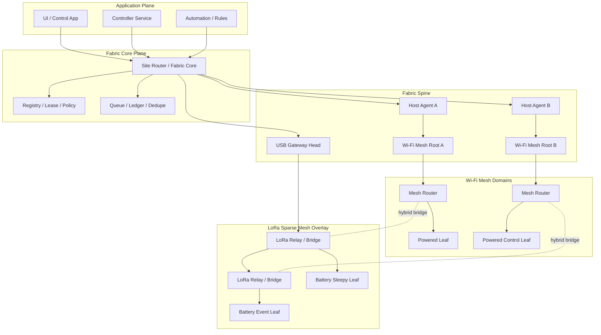

# edge-fabric-esp32sx1262

`ESP32-S3 + SX1262` を前提にした、**LoRa と Wi-Fi のハイブリッド・メッシュ対応汎用 IoT 通信基盤**の仕様先行リポジトリです。  
今回の版では、前回までの「LoRa と Wi-Fi を自動で使い分ける fabric」をさらに進めて、**自立メッシュを前提にした構成**へ再設計しています。

この repo が目指す完成形は、次のようなものです。

- **1 台の ESP32S3 + SX1262** を Ubuntu / Raspberry Pi / PC に接続して、site の入口にできる
- その配下に **数十〜数百台規模**の ESP32S3 + SX1262 ノードをぶら下げられる
- ノードの中には  
  - battery の超低消費ノード  
  - 人感 / 接点 / 漏水などのイベントノード  
  - サーボやリレーを扱う制御ノード  
  - always-on の橋渡しノード  
  - Ubuntu server / controller client  
  が混在してよい
- **Wi-Fi で届く・速さが要る・制御が重い**ものは Wi-Fi 側で処理する
- **遠い・疎・重要・省電力**なものは LoRa 側で処理する
- 開発者は `state / event / command / heartbeat / file_chunk` を意識すればよく、  
  **LoRa を使うか Wi-Fi を使うか、どの経路を選ぶか、どの親機を通るか**は fabric が決める
- しかも **自立メッシュ**として、powered ノード同士が骨格を作り、障害時に迂回できる

---

## 今回の版で明確にした大前提

### 1. mesh はやる
前回版は「複数 gateway / host / site router」は扱っていましたが、  
**自立メッシュそのもの**は主役ではありませんでした。  
今回の版では、そこを中心に組み替えています。

### 2. ただし “何でもどこでも中継” はやらない
mesh といっても、全ノードが平等に中継するわけではありません。  
それをやると電池が死にますし、LoRa もすぐ詰まります。

### 3. deep sleep ノードは relay にしない
これは今回の版の最重要ルールです。

- deep sleep なのに常時受信待受はできない
- 中継には listen と queue と retry が必要
- それを battery ノードにやらせると電池寿命の見積もりが壊れる

したがって、**deep sleep / battery / energy harvested node は leaf 専用**です。  
mesh の骨格は **always-on の powered node** が担当します。

### 4. Wi-Fi と LoRa は “同じ役割” にしない
この repo の結論は次です。

- **Wi-Fi mesh = 主骨格 / 低遅延 / 制御 / 高頻度 / 大きい payload**
- **LoRa mesh = 長距離の疎なオーバーレイ / summary / alert / fallback / battery uplink**
- **Fabric Spine = root / gateway / server 同士をつなぐ上位の背骨**

つまり「LoRa と Wi-Fi を同じようにメッシュする」のではなく、  
**役割の違う 2 種類の mesh を 1 つの fabric に束ねる**という思想です。

---

## 完成イメージ

---

## 何ができるようになる想定か

### 1. 小さい site
- Ubuntu server 1 台
- USB gateway 1 台
- battery センサー 10 台
- powered 制御ノード 5 台

### 2. 中くらいの site
- Ubuntu server 2 台
- USB gateway 2 台
- Wi-Fi mesh domain 2 つ
- LoRa relay 2〜4 台
- battery leaf 50 台
- powered leaf / control node 30 台

### 3. 大きめの site
- 複数 building / 複数 island
- 各 island に Wi-Fi mesh root
- 遠い場所は LoRa overlay でつなぐ
- 全体の logical writer は Site Router が担当
- 複数の controller client が同時に接続

---

## 重要な設計方針

- **KGuard 専用にしない**
- **アプリ API に bearer 名を出さない**
- **deep sleep node は relay にしない**
- **LoRa で無理な payload は送らない**
- **LoRa は summary / sparse / critical / fallback**
- **Wi-Fi mesh は powered backbone**
- **LoRa mesh は sparse overlay**
- **multi-host / multi-gateway / multi-domain を許可**
- **logical writer は 1 つに保つ**
- **JP production は RegionPolicy::JP を前提にする**
- **LoRaWAN の clone は作らない**
- **raw LoRa の custom mesh と Wi-Fi mesh を fabric で束ねる**

---

## 読む順番

### 最初の 7 本
1. `docs/00-reading-guide-and-glossary.md`
2. `docs/01-platform-hardware-spec.md`
3. `docs/02-platform-pinmap-and-electrical-notes.md`
4. `docs/03-japan-regulatory-and-antenna-policy.md`
5. `docs/05-system-architecture-and-runtime-boundaries.md`
6. `docs/06-node-roles-topologies-and-transport-policy.md`
7. `docs/11-requirements-master.md`

### payload / sleep / hybrid の深掘り
8. `docs/15-power-classes-sleepy-nodes-and-role-behavior.md`
9. `docs/16-lora-jp-safe-profiles-airtime-and-payload-budget.md`
10. `docs/17-compact-wire-format-payload-shapes-and-overhead.md`
11. `docs/18-bearer-selection-over-cap-policy-and-summary-codecs.md`
12. `docs/19-sleepy-node-command-poll-and-downlink-windows.md`
13. `docs/20-multi-gateway-ack-owner-and-downlink-arbitration.md`
14. `docs/21-queue-coalescing-persistence-and-flash-wear.md`
15. `docs/24-payload-cookbook-and-message-packing-examples.md`
16. `docs/25-wifi-bearer-acquisition-maintenance-and-hybrid-policy.md`

### 今回追加した mesh 再構築パート
17. `docs/26-mesh-first-architecture-overview.md`
18. `docs/27-wifi-mesh-backbone-root-domain-policy.md`
19. `docs/28-lora-sparse-mesh-overlay-and-relay-budget.md`
20. `docs/29-hybrid-routing-cost-model-and-path-classes.md`
21. `docs/30-mesh-discovery-neighbor-tables-and-route-stability.md`
22. `docs/31-multi-domain-multi-server-and-fabric-spine.md`
23. `docs/32-scale-profiles-capacity-planning-and-hop-guidance.md`
24. `docs/33-reference-deployments-and-device-patterns.md`
25. `docs/34-lora-mesh-payload-budgets-per-hop.md`
26. `docs/35-codex-mesh-roadmap-and-first-slices.md`

---

## ディレクトリ

- `docs/` 仕様本文
- `adr/` 先に固定する設計判断
- `contracts/` schema たたき台
- `examples/messages/` 例
- `calc/` airtime / payload / hop budget の計算補助
- `backlog/` 実装スライス
- `firmware/` Node SDK / Mesh Root / Gateway Head の予定地
- `host/` Host Agent / Site Router の予定地
- `sdk/` client SDK の予定地

---

## 最後に一言で言うと

この repo の狙いは、

> **ESP32-S3 + SX1262 で、battery leaf から Ubuntu controller までをひとまとめに扱える、LoRa + Wi-Fi ハイブリッド・メッシュ通信基盤を作ること**

です。

この SDK を使う側は、  
「LoRa か Wi-Fi か」ではなく「何を送りたいか」だけ考える。  
その裏で fabric が、

- route を選ぶ
- relay を選ぶ
- root / gateway を選ぶ
- retry する
- dedupe する
- summary に落とす
- deep sleep node に無理をさせない

ところまで面倒を見る、という設計にしています。
