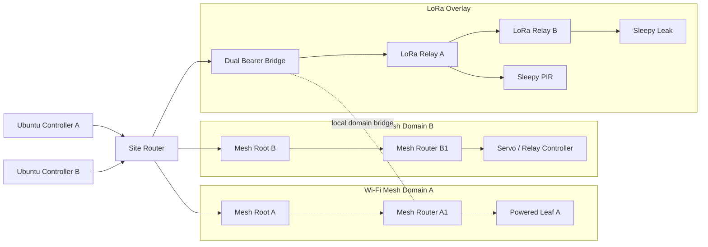

# Mesh-First Architecture Overview

## 1. まず一言で

この repo の mesh は、

- **Wi-Fi mesh が site の主骨格**
- **LoRa mesh が長距離の疎なオーバーレイ**
- **Fabric Spine が root / gateway / server をつなぐ上位背骨**

という 3 段構えです。

これにより、
- 小さい site では単純に始められ
- 大きい site では domain 分割でき
- battery node に relay を押し付けず
- long range edge も拾える
ようにします。

---

## 2. Why one mesh is not enough

### 2.1 Wi-Fi だけでは足りない
- 遠い屋外
- 省電力 battery node
- building 間のギャップ
では苦しい。

### 2.2 LoRa だけでは足りない
- payload が小さい
- latency が読みにくい
- command / bulk / diagnostics には向かない
- JP safe operation ではさらに保守的になる

### 2.3 so, hybrid mesh
だから 2 つを束ねる。

---

## 3. Three-tier mental model

## Tier 1: Local control and sensing
device の近くで決める層。
- PIR edge detect
- leak detect
- servo local loop
- local buzzer
- local interlock

## Tier 2: Site fabric mesh
LoRa / Wi-Fi を束ねる site 内通信層。
- path selection
- relay
- root/gateway selection
- summary codec
- queue/retry

## Tier 3: Site control and history
server 側で整列・保存・可視化する層。
- Site Router
- command ledger
- event ledger
- dashboards
- controller clients

---

## 4. Mesh types in this repo

### 4.1 autonomous Wi-Fi mesh
ESP-WIFI-MESH に基づく powered backbone。  
自動 parent selection と self-healing を持つ。 `[S20][S21]`

### 4.2 constrained LoRa mesh
custom store-and-forward overlay。  
自動 discovery はするが、
- relay role 制限
- hop cap
- payload cap
- duty headroom
で強く抑える。

### 4.3 application-visible fabric mesh
アプリから見ると 1 fabric だが、内部では複数 domain / path / relay がある。

---

## 5. Mesh composition rules

### RULE-A
every site has one logical writer

### RULE-B
every Wi-Fi mesh domain has one root at a time

### RULE-C
every LoRa overlay hop uses powered relay only

### RULE-D
every sleepy leaf is edge-only

### RULE-E
every control loop with strict latency stays local

---

## 6. Typical physical layout

---

## 7. What makes this “mesh-first”

- backbone を powered mesh として最初から扱う
- direct star を特別扱いしない
- site を flat な network で考えない
- route class と power class を設計の中心に置く
- deployment pattern を最初から docs に入れる

---

## 8. Main tradeoffs

### advantage
- scale up / scale down しやすい
- battery と powered を混在しやすい
- route fallback が作りやすい
- site ごとに形を変えられる

### cost
- contract が増える
- route health を持つ必要がある
- payload の shape 設計が要る
- root/gateway arbitration が要る
- test matrix が増える

この repo は、その複雑さを先に言語化して、実装で迷わないようにするためのもの。
